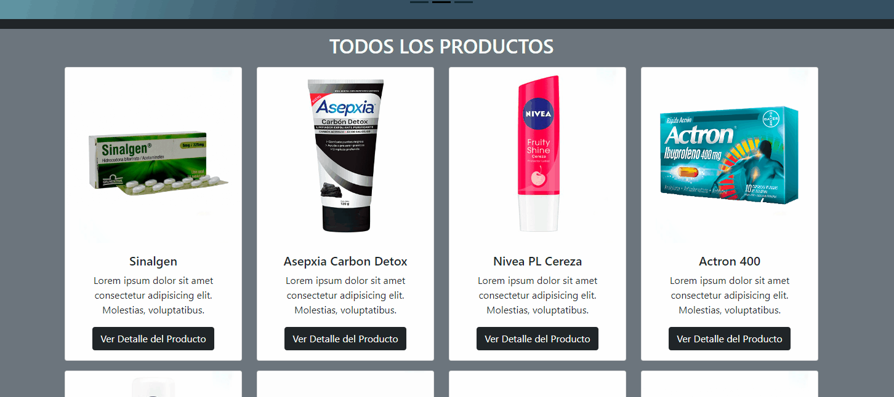
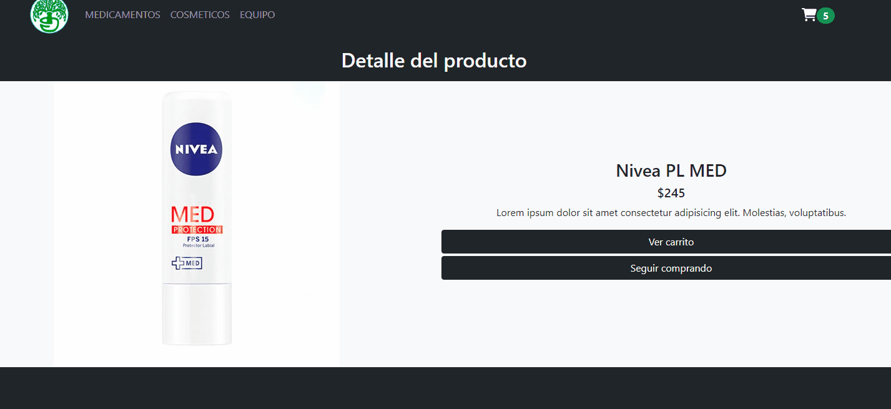
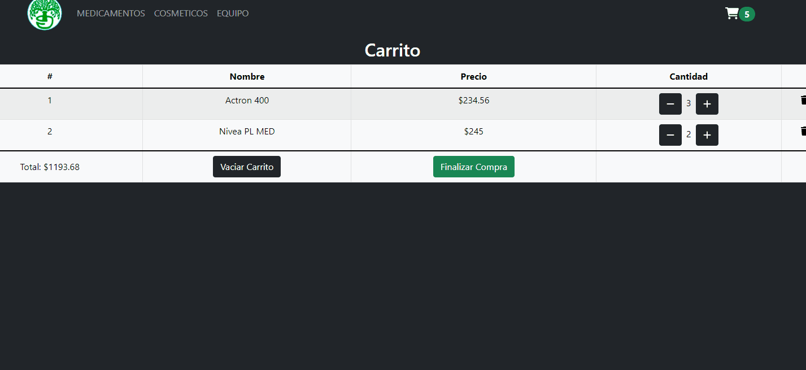
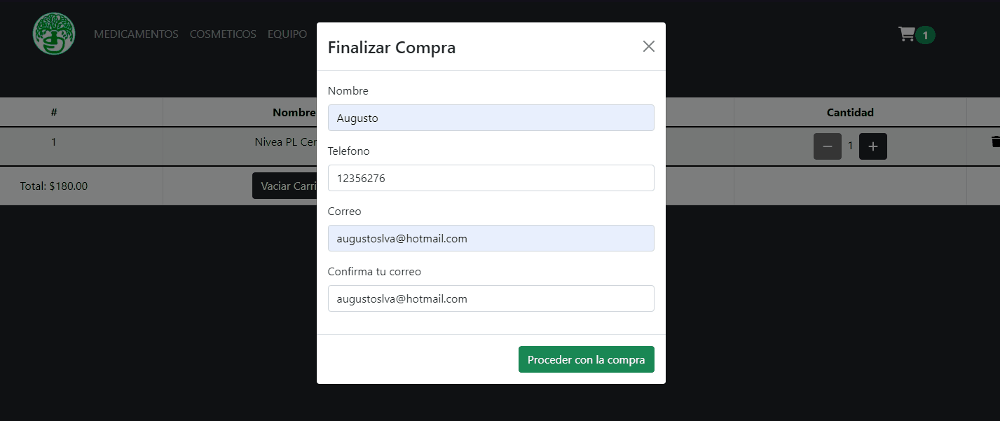

# Proyecto Final React Coderhouse Comisión 31165

Este es mi proyecto final del curso de **React** de Coderhouse!
Se trata de un **ecommerce** para una farmacia incluyendo los aspectos de
listar productos, listar productos por categoria, mostrar detalle del producto,
agregar al carrito, eliminar del carrito y crear orden de compra.
El proyecto fue creado con **React** y algunas herramientas que se describen mas abajo!


## Demo

El deploy del proyecto se encuentra alojado en Vercel
y puede accederse haciendo [click acá](https://react-pi-teal.vercel.app) o bien:

```bash
  https://react-pi-teal.vercel.app
```


## Caracteristicas

- Listar todos los productos
    
- Listar productos por categoria
    
- Mostrar detalle del producto
    
- CartWidget muestra la cantidad de items en el carrito
    
- Listar productos del carrito
    
- Formulario para finalizar la compra con validaciones
    
- Mensaje de compra exitosa y numero de orden de compra
    
- **YAPA** Pagina 404 al ingresar una url, id de producto o categoria invalidas
     

## Herramientas utilizadas

- [React 18.1.0](https://www.npmjs.com/package/react)
- [React-router-dom 6.3.0](https://www.npmjs.com/package/react-router-dom)
- [React Bootstrap 2.3.1](https://www.npmjs.com/package/react-bootstrap)
- [Firebase/Firestore 9.8.1](https://www.npmjs.com/package/firebase)
- [SweetAlert 2 11.4.17](https://www.npmjs.com/package/sweetalert2)
- [FontAwesome React Icons 0.1.18](https://www.npmjs.com/package/@fortawesome/react-fontawesome)
- [Uiball Loaders 1.2.6](https://www.npmjs.com/package/@uiball/loaders)

## Autor

- [Augusto Silva](https://www.github.com/ozkavosh)

